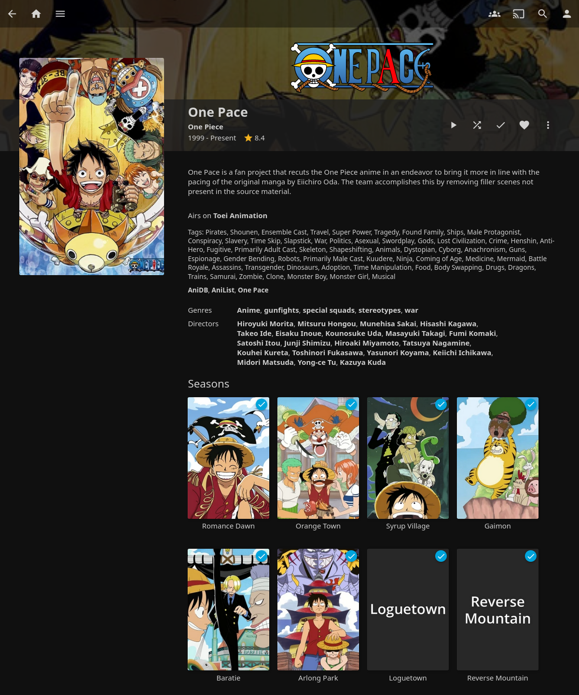
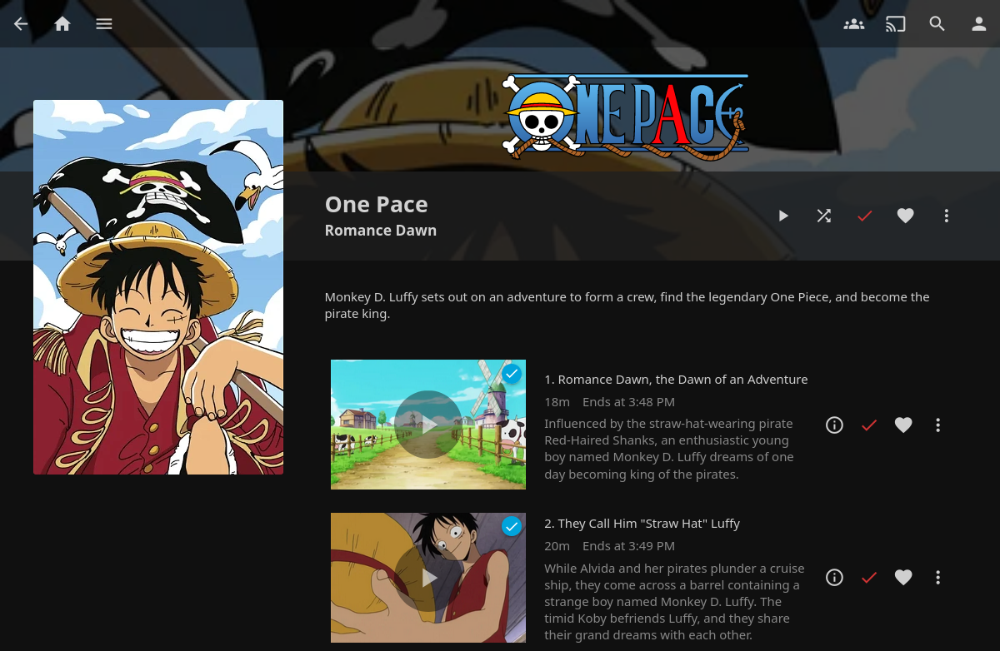

# One Pace Jellyfin Integration

This [Jellyfin](https://jellyfin.org/) plugin provides metadata and cover art integration for the [One Pace](https://onepace.net/) project.

> **If you encounter any issues, please try the [troubleshooting steps](#Troubleshooting) first.**


## What does it look like?

### Series overview




### Arc/season overview




## Installation

1. Configure the [@jwueller Jellyfin Plugin Repository](https://github.com/jwueller/jellyfin-repository)
2. Install the "One Pace" plugin from the catalog


### Configure the library

Make sure you have a library of content type "Shows". You can use an existing one or create a new one like this:

1. Go to: Dashboard - Libraries - Add Media Library
2. Set "Content Type" to "Shows"
3. Pick your library folder (e.g. `/media/anime`)

Enable the "One Pace" downloaders you want to use (most likely all of them) and move them to the top if they aren't already to ensure they take priority:

* Metadata downloaders (TV Shows)
* Metadata downloaders (Seasons)
* Metadata downloaders (Episodes)
* Image fetchers (TV Shows)
* Image fetchers (Seasons)
* Image fetchers (Episodes)

If the library was previously scanned, you might have to manually identify or refresh series metadata.

Note that the One Pace project currently doesn't have any series cover art, so you might have to either manually upload some, or enable a different provider like AniList or AniDB to fetch some for the regular One Piece series.


## Library folder structure

This integration is designed to work directly with the released files from the One Pace project.

* Paths containing "One Pace" will be scanned.
* Arcs are matched by filename manga chapter range, title or number. You can use empty folders as placeholders for unreleased arcs.
* Episodes are matched by filename CRC-32, manga chapter range or title.


### Example

```plain
/media/anime/                                    <- library
├── One Pace                                     <- series
│   ├── [One Pace][1-7] Romance Dawn [1080p]     <- arc/season
│   │   ├── [One Pace][1] Romance Dawn 01 [1080p][D767799C].mkv
│   │   ├── [One Pace][2] Romance Dawn 02 [1080p][04A43CEF].mkv
│   │   ├── [One Pace][3-5] Romance Dawn 03 [1080p][C7CA5080].mkv
│   │   └── [One Pace][5-7] Romance Dawn 04 [1080p][09DD81D3].mkv
│   ├── [One Pace][8-21] Orange Town [1080p]     <- arc/season
│   │   ├── [One Pace][11-16] Orange Town 02 [480p][3D7957D8].mkv
│   │   ├── [One Pace][17-21] Orange Town 03 [480p][800263CF].mkv
│   │   └── [One Pace][8-11] Orange Town 01 [480p][A2F5F372].mkv
│   ├── [One Pace][23-41] Syrup Village [480p]   <- arc/season
│   │   ├── [One Pace][23-25] Syrup Village 01 [480p][B19F374A].mkv
│   │   ├── [One Pace][26-27] Syrup Village 02 [480p][7EE6C65F].mkv
│   │   ├── [One Pace][28-30] Syrup Village 03 [480p][C2C0A86A].mkv
│   │   ├── [One Pace][31-34] Syrup Village 04 [480p][FD399699].mkv
│   │   ├── [One Pace][35-39] Syrup Village 05 [480p][5498C538].mkv
│   │   └── [One Pace][40-41] Syrup Village 06 [480p][D1742A98].mkv
...
```


## Troubleshooting

### Arcs/seasons are not detected correctly

You might be missing a series-folder. To ensure that your folder structure is correct, please follow these steps:

1. Note down the folder path for the library you configured this plugin for.
2. Ensure that the library folder contains _one folder per series_ (e.g. `One Pace`).
3. Ensure that the `One Pace` series folder contains _one folder per arc/season_, (e.g. `[One Pace][1-7] Romance Dawn [1080p]`).
4. Ensure that the video files are placed _within the respective arc/season folder_.
5. Replace all metadata for the library (see the [Outdated metadata](#Outdated-metadata) section).

Jellyfin expects a folder for both the series and each of the seasons/arcs. That means that you can't put your arcs directly into the library if you made one specifically for One Pace.

This **doesn't work**, because the series folder is missing:

```
/media/One Pace/[One Pace][1-7] Romance Dawn [1080p]/[One Pace][1] Romance Dawn 01 [1080p][D767799C].mkv
^^^^^^^^^^^^^^^ ^^^^^^^^^^^^^^^^^^^^^^^^^^^^^^^^^^^^ ^^^^^^^^^^^^^^^^^^^^^^^^^^^^^^^^^^^^^^^^^^^^^^^^^^^
library         season/arc                           episode
```

In this case, you would need an additional season folder at the root of the library:

```
/media/One Pace/One Pace/[One Pace][1-7] Romance Dawn [1080p]/[One Pace][1] Romance Dawn 01 [1080p][D767799C].mkv
^^^^^^^^^^^^^^^ ^^^^^^^^ ^^^^^^^^^^^^^^^^^^^^^^^^^^^^^^^^^^^^ ^^^^^^^^^^^^^^^^^^^^^^^^^^^^^^^^^^^^^^^^^^^^^^^^^^^
library         series   season/arc                           episode
```


### Outdated metadata

If you are experiencing issues with outdated/partial data, please try explicitly replacing all metadata. This applies to Jellyfin in general and isn't specific to this plugin.

1. Press the three dots on the library.
2. Select "Refresh metadata".
3. Select "Replace all metadata" from the dropdown.
4. Check "Replace existing images", if desired.
5. Click the "Refresh" button.
6. Wait for the scan to finish.
